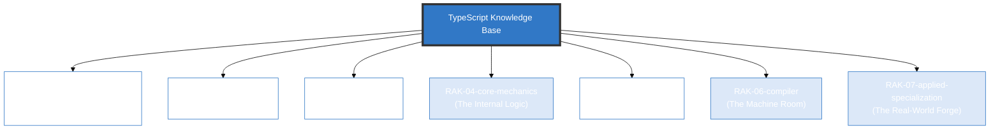

# TypeScript Knowledge Base

> **"The Compiler's Blueprint: Write once, type-check forever."**

## 🏛️ Arsitektur 6-Rak (Universal Standard)
Repositori ini menggunakan **6-Rack Universal Architecture** dengan prinsip **Digital Mirroring** untuk memisahkan antara fondasi penggunaan dengan dekonstruksi arsitektur mesin.

---

## 🗄️ Struktur Perpustakaan

### 1. [RAK-01-anatomy-and-history](./RAK-01-anatomy-and-history/)
Mengenal TypeScript dari awal: filosofi superset, sejarah penciptaan, anatomi bahasa, dan mengapa static typing penting.

### 2. [RAK-02-foundation](./RAK-02-foundation/)
Fondasi sintaks sehari-hari: Primitives, Narrowing, Objects, Functions, Classes, Interfaces, dan Enums berdasarkan TS Handbook.

### 3. [RAK-03-evolution](./RAK-03-evolution/)
Analisis versi `tsc` dari masa ke masa: changelog fitur, deprecations, dan roadmap masa depan TypeScript.

### 4. [RAK-04-core-mechanics](./RAK-04-core-mechanics/)
Sistem tipe lanjutan: Generics, Mapped Types, Conditional Types, Template Literal Types, dan algoritma Type Inference.

### 5. [RAK-05-ecosystem](./RAK-05-ecosystem/)
`tsconfig.json`, deklarasi `@types` & `.d.ts`, integrasi Bundler modern (Vite/esbuild/Webpack), dan module resolution.

### 6. [RAK-06-compiler](./RAK-06-compiler/)
Deep dive ke ruang mesin `tsc`: Lexer, AST Generation, Type Checker stages, Emitter, dan Transformer API.

### 7. [RAK-07-applied-specialization](./RAK-07-applied-specialization/)
TypeScript di dunia nyata: Design Patterns, Clean Architecture, Domain-Driven Design, dan integrasi dengan framework (React, NestJS, Node.js).

---

## 📏 Standar Kualitas (Gold Standard)
Setiap materi mengikuti prinsip **Digital Mirroring** dan standar **PPM V4** yang mewajibkan:
1. **Source-Synced**: Akurasi 1:1 terhadap dokumentasi resmi/spesifikasi.
2. **Experimental Lab**: Kode pembuktian fungsional di folder `examples/`.
3. **Mental Model Visual**: Diagram Mermaid di folder `assets/`.
4. **Narrative Excellence**: Penjelasan mendalam dengan analogi dunia nyata.

*Dokumentasi Lengkap Standar: [docs/standards/architecture.md](./docs/standards/architecture.md)*

---
*Status Pengembangan: [status.md](./status.md)*
