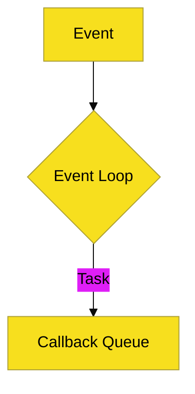

# Panduan Estetika Visual (JS Edition)

Mencerminkan energi dan interaktivitas web.

## 1. Skema Warna (Branding)
- **Primary Color**: `#F7DF1E` (JS Yellow).
- **Secondary Color**: `#000000` (Classic Black).
- **Action Color**: `#61DAFB` (React Cyan - optional for frameworks).

## 2. Standar Mermaid
Diagram harus terlihat dinamis dan mengalir:

## 3. Simbol Visual
- **Lingkaran Berputar**: Mewakili **Event Loop**.
- **Warna Kuning**: Digunakan untuk elemen yang bersifat *blocking*.
- **Warna Transparan**: Digunakan untuk operasi *Background/Asynchronous*.
