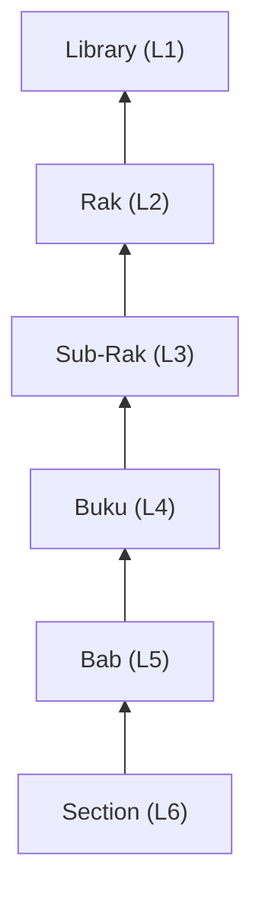

# Protokol Pembaruan Status (Unified Edition)

Progress pengerjaan repositori dihitung secara otomatis (bubbling up) dari unit terkecil untuk memastikan akurasi data.

## 1. Unit Dasar: Bab (Chapter) & Section
Status dicatat langsung di dalam `README.md` pada folder masing-masing.
- `[ ] Draft`: Narasi awal (Stage 1).
- `[/] Partial`: Pengerjaan lab/visual (Stage 2-3).
- `[x] Complete`: Lulus audit Sentinel (Gold Standard).

## 2. Unit Menengah: Buku (Book)
Status Buku ditentukan oleh persentase penyelesaian Bab di dalamnya.
- **Rumus**: `(Σ Bab Complete) / (Total Bab)`.
- Dicatat pada `README.md` di level Buku.

## 3. Unit Utama: Rak (Rack) & Global
Global progress dipusatkan pada file `status.md` di root repositori.
- **Pembaruan**: Dilakukan setiap kali Sub-Rak atau Rak mencapai milestone signifikan.
- **Dashboard**: Gunakan tabel status di root `status.md` sebagai sumber kebenaran (Source of Truth).

---

## Mekanisme "Bubbling Up"

Setiap perubahan di tingkat terbawah (Section/Bab) harus "menguap" hingga memperbarui angka persentase di tingkat Global (Root).

---
*Status: Gold Standard hanya dicapai jika seluruh checklist PPM V4 terpenuhi.*
